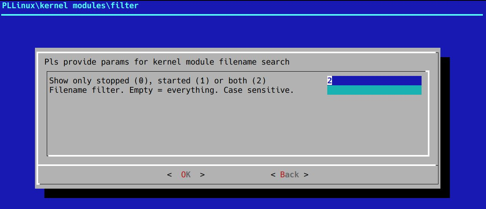
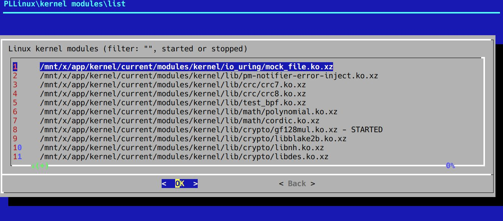
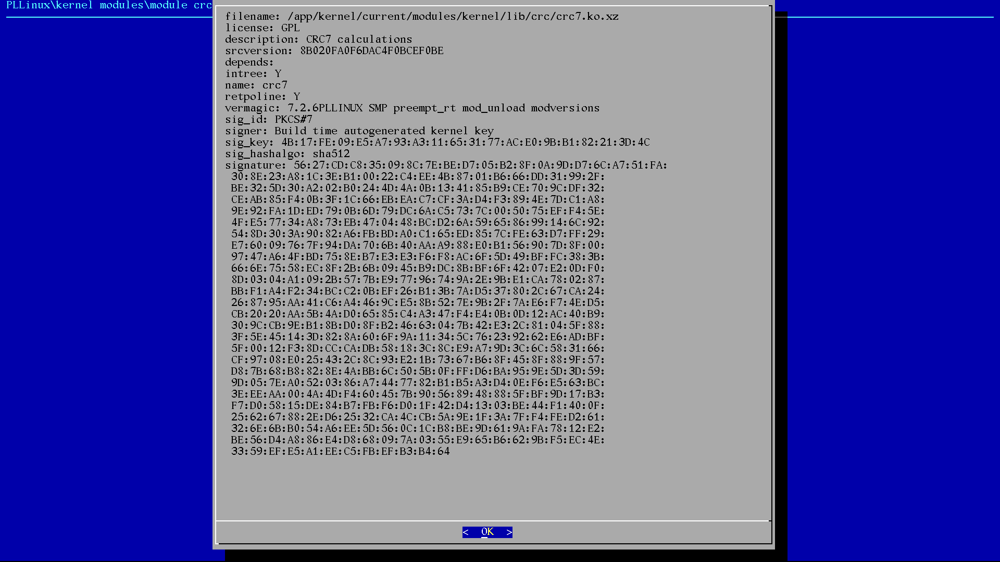

[Prev page](file_yq_milestone9.md) [Next page](file_zz_milestone.md)

# Milestone 10

# Logging

PLLinux should be user friendly. There was longer time spent on extending **pllinux** and currently (11 Sep 2026) it's main menu looks this way:

When we speak about logging - in theory system could implement logging in the syslog standard and done (kernel log saved with **dmesg** should have redirection possibility, the same services created with **dinit** could have private logs or could be redirected, etc.)

I started with using **syslogd** from **busybox**. It should support very standard format ([according to the example](https://github.com/brgl/busybox/blob/master/docs/syslog.conf.txt)). After some tries it was found, that operators ! and != don't work like in the example and syslog.conf end with this content:

    kern.* /log/tmp/kernel
    daemon.* /log/tmp/services
    auth.* /log/tmp/auth
    syslog.* /log/tmp/syslog
    cron.* /log/tmp/cron

And... kernel messages are not logged, the same these from cron (could be some config mistake) and from the daemon/dinit (it was naturally extra configured to redirect everything).

This was time to check alternatives. syslog-ng has got other config, rsyslog seems to be used widely and seems to have compatiblity with old syslog format. After some steps it was compiled and installed... it's recognizing config, doesn't show any error and doesn't save anything to log files.

Conversion from busybox's syslogd is not plug-and-plug. But why?

Helps comes from the **strace** - when started with **rsyslogd**, it shows, that this daemon is searching for /dev/log device.

But shouldn't be, that logging daemon is creating everything when has got rules already? Shouldn't **rsyslogd** show itself, that device is not found or something? (and here we are again going into this, that Open Source is many times overcomplicated or full of unclear or even stupid things)

Anyway, what can be done with the problem with /dev/log?

    module(load="imuxsock") #local system logging
    module(load="imkmsg") #kernel boot messages (from ring buffer and /dev/kmsg). Cannot be used with imklog module

These two magic lines in **syslog.conf** (named here by default **rsyslog.conf**) made, that **rsyslog** finally started collecting messages. For people saying "RTFM" I would answer - it could show message "no data collecting modules" or modules should be loaded automagically when all these rules with filenames are already in config file.

With modules I was able to get authentication info (but only for root), something from **cron**, boot messages from kernel and **rsyslog** itself. Quite everything was collected when **rsyslog** was started & restarted as service (but why?). And I haven't seen **dinit** messages = there is still a lot of todo, but at least progress is visible.

Offtopic: what about journald service?

Answer: Collecting logs from different sources is generally good idea, from the other hand somebody created syslog and then duplicated it "a little" bit. 
Right now (on the VDI machine, where I write these words) my logs files have >600MB. Normal users don't know about things like this 
and they naive think, that Linux is small and fast... but standard installations are becoming bloated like Windows. 
PLLinux will make for now logs just with **rsyslogd** to avoid duplicates + centralized solution in the future cannot make duplicates + 
standard setup will write majority of logs into tmpfs by default (disclaimer: how many times were you looking into them in the home machine? 
Do you really need log from every boot? Or every start of your printer daemon or similar stuff?)

Returning to the logging problems - the solution was changing services starting order:

1. service **boot** is starting (new) **bootsh** and (old) **syslogd**, **crond**, **tty1**, etc.
2. **syslogd** is waiting for start completion for **bootsh**
3. other services (**crond**, **tty1**, etc.) are waiting for start completion for **syslogd**

Currently:

1. **dinitctl** can stop or restart **bootsh** (it this problem?)
2. logging non-admin users is not saved in logs (is it busybox's **login** command limit?)
3. boot screen finally looks clean

I don't like syntax for rsyslog (instead of all these ! or != it would be enough to give list of priorities separated by comma and it would be consistent with list of events), but...

# Scheduler

Background tasks could be started in two ways:

1. on the specified time (but should happen, when this is missed?)
2. after some specified time (for example once a day)

PLLinux will start from number one - this is classical **cron** provided by **crond** from **busybox**. It doesn't have support for /etc/crontab, just for files from every user.

# Kernel modules

In the beginning kernel modules required 5GB, but after few tweaks (disabling debug, packing, etc.) it was possible to go below 60MB. Interesting is that all indexing files required extra 4MB (we could probably resign from them in the future - another binary or text indexing files gone).

Options provided by *dialog* are maybe not very big, but allow for creating quite impresive menus, for example:

System should be easy (user shouldn't search for command line) and currently disabling something will do this action after system restart. In the future there will be implemented starting with dependencies.

# Boot sequence

After enabling efivarfs and some other elements it was possible to see and change UEFI boot menu. With mounting boot fat32 partition, signed EFI modules and few other things it's actually already possible to build full boot chain.

And then I started analysing things more deeply... and was terrified.

Why?

I looked in my Ubuntu and Debian installation. First of all they have few copies of the same font file (unicode.pf2) in few places.

"No big deal" - somebody could say. These are just 2MB saved in other places. That's correct, only 2MB... but 2MB, 2MB there and there. And it only confirms, that Open Source became big and bloated (or it was always this way).

Anyway, minimalistic boot chain (without encryption) looks this way:

1. menu in UEFI pointing to FAT32 partition and shimx64.efi (it will be used in the future in the Secure Boot and it will check if everything is nice signed)
2. on the EFI32 partition: shimx64.efi pointing to the grubx64.efi (this one is displaying menu, loading kernel, etc.)
3. on the EFI32 partition: grubx64.efi reading config file showing location of the main config file in the main partition (in this case PLLinux partition)

3. 

[Prev page](file_yq_milestone9.md) [Next page](file_zz_milestone.md)
