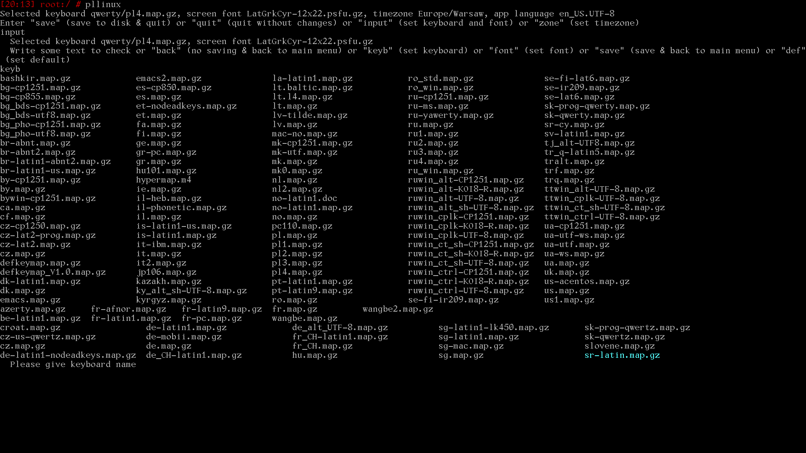
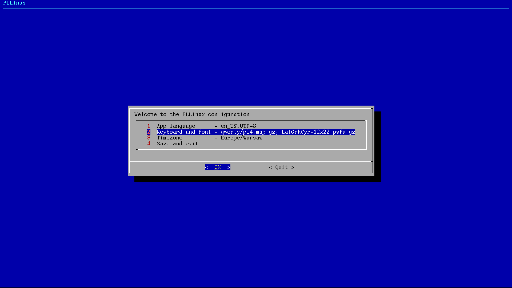
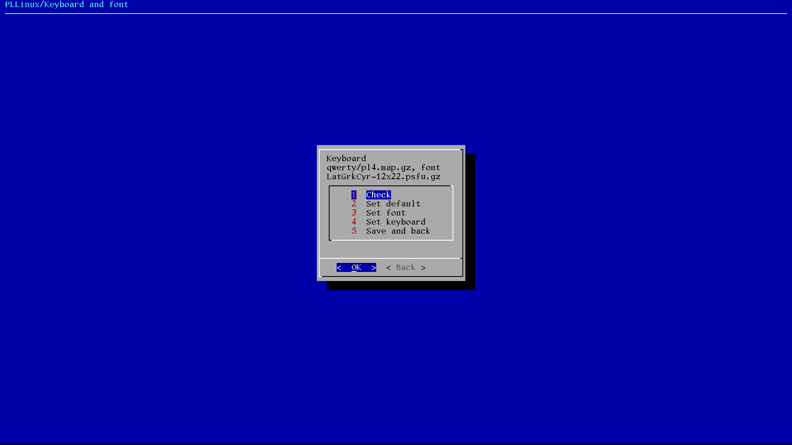

[Prev page](file_yr_milestone8.md) [Next page](file_zz_milestone10.md)

# Milestone 9
# Correct man

It's time to make PLLinux more nice looking. First with man - solution was using more advanced less command
than available from busybox.

# Configurator with dialog

PLLinux script makes work, but definitely doesn't look nice. It's time for somethine else.

It's just beginning, but for now it will be done with dialog command / application. You can find a lot about it, for example:

1. [Creating dialog boxes with the Dialog Tool in Linux](https://www.geeksforgeeks.org/linux-unix/creating-dialog-boxes-with-the-dialog-tool-in-linux/)
2. [dialog](https://linuxcommand.org/lc3_adv_dialog.php)
3. [Bash and Dialog scripting](https://github.com/RileyMeta/Bash-Dialog)
4. [How can I create a select menu in a shell script?](https://askubuntu.com/questions/1705/how-can-i-create-a-select-menu-in-a-shell-script)

And some of you are maybe familiar with older Debian and other installers - they're done with similar approach. 

Does it mean, that PLLinux the same way? (one-line console, console menu, text graphic installers, graphic installer)

We will see, from history: have you seen Linux terminal in the old printer working as output device? [teletype as a linux terminal](https://www.youtube.com/watch?v=AwqryPuwl_w)

[Prev page](file_yr_milestone8.md) [Next page](file_zz_milestone10.md)
