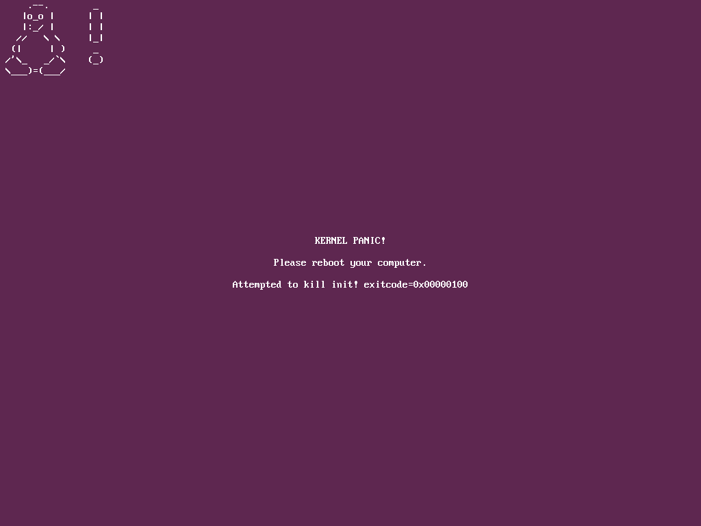
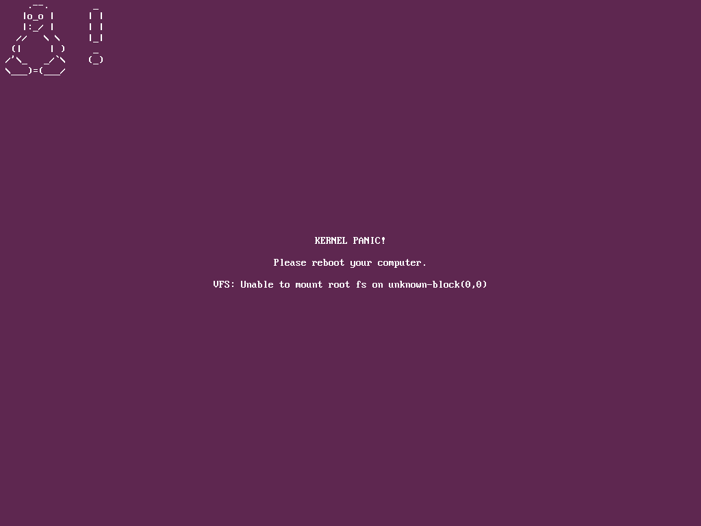

# Milestone 1
# Development environment

All development is done in Lubuntu 26.04 LTS installed inside VirtualBox (this compbination is maybe not best choice 
on the world, but good enough).

Host system is installed in one virtual disk (20GB+50GB in total), EXT4 partition with new system (2GB) in second,
additionally there is added GRUB boot entry starting new system with these steps:

  1. created [file /etc/grub.d/40_custom](40_custom) with correct UUID for new filesystem (get with **sudo blkid**)
  2. refreshed GRUB with **sudo update-grub**

We don't use anything special here, so it's enough to setup any other modern distribution (note: my descriptions
will be mainly Ubuntu based)

# Booting process

Let's assume, that we're not using ancient X86 and we have UEFI. Typical Linux boot process could be
described this way:

  1. User is selecting boot option in UEFI
  2. UEFI is starting correct EFI file (OS bootloader) from FAT32 partition in the disk
  3. (optionally) OS bootloader is asking for password for OS partition
  4. OS bootloader is starting Linux kernel with initial initroomfs filesystem (both taken from OS partition) 
 and some parameters (in our case parameters are taken from [the 40_custom file](40_custom) file)
  5. Linux kernel is starting **init** script from initroomfs filesystem
  6. Init script is loading all drivers, modules, etc.
  7. Init script is moving filesystem from the initramfs to the OS partition (normally using **switch_root**)
  8. Init script is starting process with PID 1 from main OS partition
  7. Process with PID 1 is taking care about loading system services (working in background) and login 
prompts for shell or graphic environment

In first version in points 1 and 2 we will use elements from existing host (Lubuntu) and we won't have points 3 and 6. Our [initial init script](init) is:

  1. mounting **dev** and **proc** filesystems from the kernel
  2. searching in kernel params for string **root=UUID=......** and extracting UUID (we need it, because kernel can differently
enumerate **/dev/...** with every boot)
  3. searching for **/dev/...** device name for our filesystem (because "modern" **fsck.ext4** doesn't understand UUID=... format)
  4. making filesystem check with **fsck**
  5. trying to mount new main OS filesystem
  6. if 5 failed, going into recovery shell
  7. if 5 is OK, mounting all filesystems from the kernel, switching root of the OS filesystem and executing our PID 1 **dinit** application
  8. PID 1 application is making further magic (described later)

As you can see, we don't setup PATH and other stuff (minimalism forever). 

Our initramfs is created with the **find . -print0 | cpio --null --create --verbose --format=newc | gzip --best > ../app/kernel/current/initramfs.gz** command,
can be unpacked with **gunzip initramfs.gz && cpio -ivF initramfs**

If kernel doesn't find file with initramfs or it will be in wrong non-recognized format or without executable **init** file or when **init** script will
fail/crash with error, kernel will display (border?) Screen of Death, in my opinion very problematic, because covers normal bootup messages and sometimes
doesn't show enough info about rootcause problems.

Please note, that our initial initramfs is only ca. 1,3MB big (without fsck) or ca. 3MB big (with fsck). These from Ubuntu are bigger than 40MB. Small difference, right?

# Filesystem and system structure

  * /app - apps put into separate directories (the initial idea is/was, that they have user written files, but after consideration it was abandomed and
currently you have only "package" files)
  * /bin - should be removed in some moment, currently contains link to the **login** application
  * /dev, /proc, /run, /sys - kernel filesystems
  * /tmp - temporary filesystem in RAM
  * /home - user files, every user will have in home folder app (files created by apps, separated among apps) and files folder (documents)
  * /etc - general system configuration

Where is this magic?

  1. PID 1 application has got access to everything and it's starting processes for asking for login
  2. processes for asking for login are started in own sandboxes (which don't have everything already)
  3. processes for login after receiving correct user and password are preparing internal sandbox for user enviroment (with available set of apps), where /home is created from
/home/{user}/files and /other is created from /home/{user}/app/{shell} folder (HOME environment variable will be setup to it)
  4. when user is starting some special app, it can be run even in deeper sandbox

It means, we have sandbox in sandbox in sandbox (in the future there will be maybe second evaluation for sandbox from point 2 done and it
will be checked, if it's really required). The idea is, that every layer contains minimum set of directories and files, for example layer user sandbox
from point 3 doesn't see directories from other users, etc.

You could say: OK, but we can achieve it with correct filesystem permissions.

Yes, indeed, correctly configured system can achieve similar things. But... world is not perfect and there are bugs or human mistakes or intentional actions done by devs.
Every next protection layer is always welcome - if you don't see directories and files, possible vector attack could be smaller.

But why we want to avoid /bin and other standard directories?

Modern UNIX-like systems became nightmare - you put everything together and pray, that it can work together. We want to have full modularity and easy
separating apps, because it's easier to control, what need what (and minimalize amount of problems with overwriting libraries).

You could say: there is NixOS with this already.

Yes, but their folders structure is rather human unreadable. We also want to remove list of apps from potentially problematic apps (like web servers).

What about sudo?

Yes, this is problematic, because every sandbox below will have less rights than parent. You can either login normally as second user (root) or...
make things with services in the system (they're run by PID1).

And problems with shell interpreters given in first line of shell script?

This problem will be further investigated.

And what with problems with linking libraries?

Linux is using normally ldso loader - instead of automatic searching for libraries we prefer scripts starting binary with libraries from concrete directory, for example:

**/app/ldso/ld-linux-x86-64.so.2 --library-path /app/libc/2.43:/app/libtinfo /app/bash/current/bin/bash**

or

**/app/ldso/ld-linux-x86-64.so.2 --library-path /app/libc/2.43:/app/mc/current/lib --argv0 mcedit /app/mc/current/usr/bin/mc**

(--library-path for giving path with libraries and --argv0 for setting up binary name)

# Core components

**Kernel**

Linux kernel is available in [kernel.org](https://kernel.org/). You need to:

  1. download it
  2. unpack
  3. **sudo apt install build-essential libncurses-dev bc libelf-dev bison** - these will be probably all required packages for Ubuntu
  4. (optionall) copy [config file](.config) into unpacked tree
  5. **make menuconfig** for entering easy config menu
  6. **make -j 4** for compilation (instead of 4 use number of CPU cores, the more, the better)
  7. copy generated **bzImage** file arch/x86/boot/bzImage
(note: we don't look on modules in this moment)

My config is nothing special - I just removed various debugging options and ancient / exotic architectures (for example old EXT2 or Amiga filesystem)

Funny notes:

  * USB mass storage needs SCSI disk support

**Sandbox tool**

Bubblewrap (bwrap) code is available under [github](https://github.com/containers/bubblewrap). For our purposes (making things very simple) we need the best
static version (compiled without external libraries) and [this is provided by Alpine Linux](https://pkgs.org/download/bubblewrap-static).

Why bubblewrap?

It can work without **sudo** in contrast to the **chroot**, additionally is used by prominent projects like Flatpak. You can limit permissions and have support for such
kernel features like overlayfs (merging different directories into one).

**Basic tools environment (cp, ls, etc.)**

We will start with busybox available in [busybox.net](https://busybox.net/) and very popular in embedded environments. It's build from the source.

In the future there will be probably provided (additionally?) coreutils package.

**Some tools like fsck.ext4 kernel tools**

Part of kernel tools from [kernel.org](https://www.kernel.org/pub/linux/utils/util-linux/). They duplicate **busybox** version, but normally can provide more options.

**PID 1 process / service manager**

Currently we use **dinit** available under [GitHub](https://github.com/davmac314/dinit).

Why dinit?

Original Unix systems used runlevel concept and it was quite limited. During some tests there were investigated options available in:

  1. **busybox** (it has got **init** command and can use similar concept to classical runlevel system with [inittab](inittab), but problem
was with documentation and finally there was found [Init System](https://deepwiki.com/mirror/busybox/4.1-init-system) and
[BusyBox Init System: A Lightweight Approach to System Initialization](https://www.foxipex.com/2024/11/15/busybox-init-system-a-lightweight-approach-to-system-initialization/))
  2. [https://smarden.org/runit/](**runit**) (but project looked a little bit like abandomed [even on Github](https://github.com/g-pape/runit)
and during some tests started creating files on disk, which we want to avoid)
  3. [https://github.com/rinit-org/rinit](**rinit**) (nice options, but project looks too frish)
  4. **systemd** (really overcomplicated)

and finally there was **dinit** selected, because it seems to have minimum amount of options like:

  1. dependencies
  2. retries

Notes: 

  1. it doesn't have scheduling and for this we need to build service probably and you can see 
[some kind of comparison with others](https://github.com/davmac314/dinit/blob/master/doc/COMPARISON)
  2. in the future we could consider merging it maybe with **busybox** (**busybox** for critical things, **dinit** for things controlled by users)

We compiled it with own config - TODO describe it.

**Bash**

For minimal environment there is enough to have **sh** shell from **busybox**, for extra addition you could use **bash** shell from
[https://www.gnu.org/software/bash/](https://www.gnu.org/software/bash/)

**Midnight Commander**

[https://midnight-commander.org/](https://midnight-commander.org/)

# Rebooting

**dinit** is providing **shutdown** command, we created **poweroff.sh** and **reboot.sh** scripts with it. To make them working
with non-root users we had to give read/write permissions to the /run/dinitctl.

# Running (note: this version was not released)

  * create EXT4 partition in existing Ubuntu system
  * unpack our M1 file into new partition
  * get UUID for partition with **sudo blkid**
  * copy [file /etc/grub.d/40_custom](40_custom) with correct UUID for new filesystem
  * refresh GRUB with **sudo update-grub**
  * reboot and select correct menu option in your system
  * to login: use root/root, user/user, user2/user2
  * to switching consoles in Virtualbox: right Ctrl+F1, right Ctrl+F2, etc.

