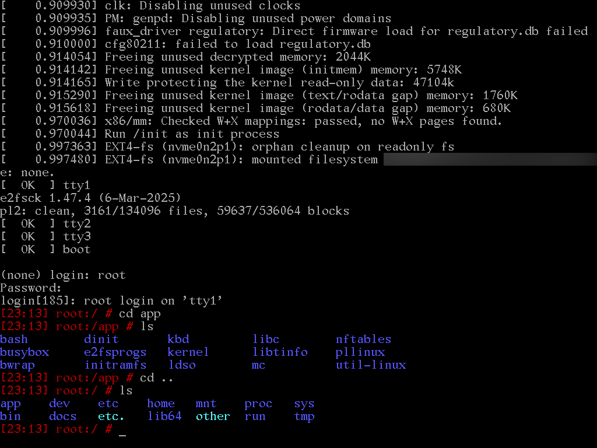
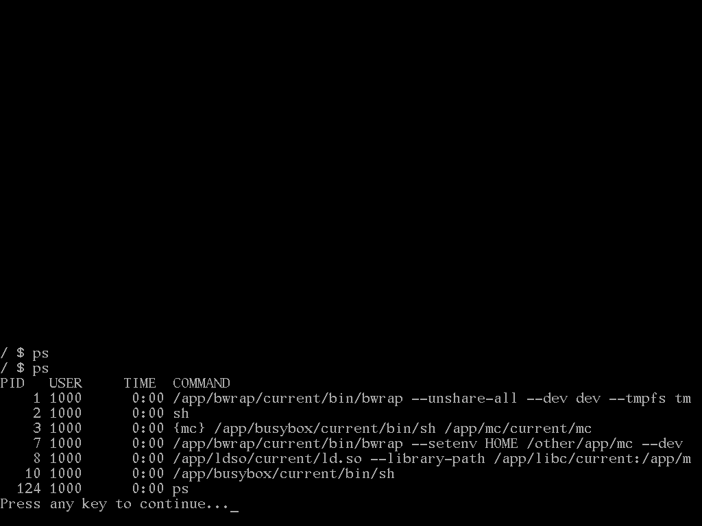
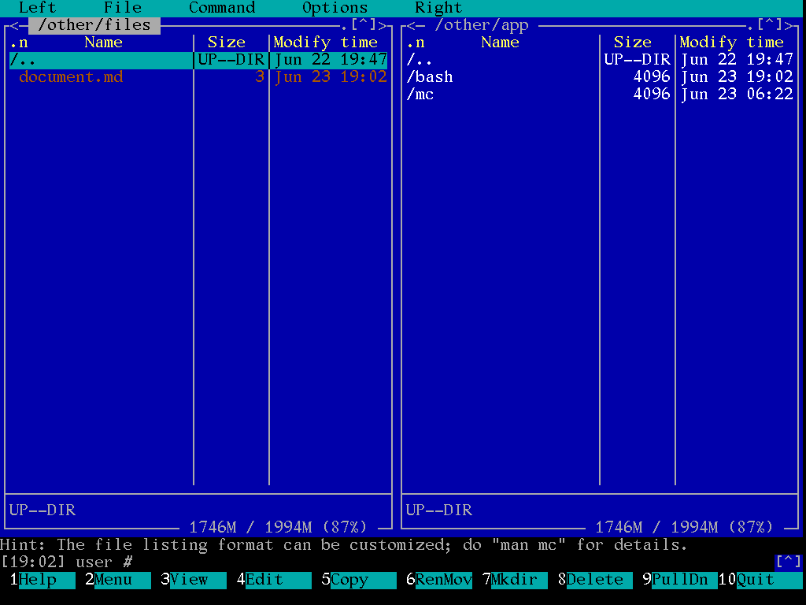

# Milestone 3
# App folder structure

/app1/version1
/app1/version2
/app1/current
/app2/version1
/app2/version2
/app2/current

In current implementation we make links from current app version to the current and we use current in many scripts, additionally normally directories with version are created using pattern "YYMMDD_version_from_the_app", where YYMMDD is year, month and day of creating package (in the future date will be eventually removed)

Every version should contain in own root readme.md file with info about package, source, license, system services, man pages, firewall rules, etc.

"But where is this revolution?"

  1. Every operation on these files are done from system script and app installer itself doesn't have rights (additionally script for changing something in app folder during installation will be running in sandbox created by Bubblewrap)
  2. You can share with user only "current" version of the app or any version of the app
  3. You don't need to share with user all apps info

"But changing /app later needs user logout"

In some cases probably yes (when we share only concrete versions), in some not (when we share the whole /app).

"What about hardcoding path with version name and mounting for user the same directory with current?"

There will be probably both mounted.

"What about editing /etc or /app from root account?"

MC package contains example of different setup and allows for it.

# Network

Linux kernel is very good prepared for networking - all you need is tool for enabling / disabling and configuring network interfaces (**busybox** has got everything) and (when want to have secure system) **firewall**

Configuration can be done using **ifplugd** from **busybox** (it can call **ifup** and **ifdown**, they can read /etc/network/configuration file and for example run **udhcpd** connecting to the DHCP server and later running PLLINUX script configuring interface or run scripts removing this configuration).

With firewall it would be good to have tool like OpenSnitch asking user for blocking / accepting all connection, but for the start PLLINUX is using something called **nftables** (it's newer version of the old, good **iptables**)

# Dynamic linking and interpreters again

This topic returns like boomerang. Shell scripts  usually have in the first line link to interpreter, similar thing is with binary files, which require external libraries (they normally have also similar link and interpreter is named dynamic loader). PLLINUX could potentially run EVERY command this way:

**interpreter binary/shell_script options**

and this is done initially, but not very economical.

[NixOS is proposing patching such files](https://wiki.nixos.org/wiki/Packaging/Binaries), but... PLLINUX wants to use them without modifications, if possible.

Dynamic loader from Linux systems (normally /lib64/ld-linux-x86-64.so.2) doesn't allow for having separate setup for every directory. This system allows for different tricks (for example replacing app libraries with own) and could be used for intercepting things.

In the future we could take glibc source and modify elf/dl-load.c this way, that it will have separate setup for every directory in the /etc/ld.so.conf (it should be read from /app from **readme.md** file in similar way like it's done by script creating user sandbox)

There will be probably also left in the filesystem link from "standard" locations (like /bin/sh).

# Packages

System in this moment has got 15 packages:

**bash
busybox
bwrap
dinit
e2fsprogs
initramfs
kbd
kernel
ldso
libc
libtinfo
mc
nftables
pllinux
util-linux
**

Almost everything is currently compiled from source using script [**doit.sh**](doit/doit.sh), which is:

  1. downloading source from the internet
  2. unpacking it to the out subdirectory
  3. copying package files from the in directory (if available)
  4. compiling
  5. creating package in the app directory

Packages without special optimalization need 128MB on the disk. PLLINUX in this moment doesn't have GUI, but this is quite comparable with first Windows NT versions (Wikipedia say about 90MB for NT3.5 and 124MB for NT4.0)

# System in this moment

Font is provided by kbd package. In theory it should be possible to map also Polish keyboard, but... the whole package seems to be quite obsolete and needs further investigation (it's potentially possible to change screen size with GRUB options)

System needs ca. 100MB RAM. Without **dinit** it could be maybe a little less, in further version probably we don't need more much more - there must added cron and acpi daemon/service from busybox, syslog and few details and in command line version that's it, for example mounting daemons are started on demand.

In the first screen from root account, in the second from user account. Power of the modularity - the same system & other apps served for other users (+ we don't show them all versions, when don't want), only absolute necessary system files are shown.

Another nice profit from bwrap - we could limit for example proc info and show only own user apps.

This concept is still investigated - idea is, that normal users in /home see only documents and in the /other file data from other apps in normal Linux saved in /home (root user will see in /home directories from all users and in the /other file data from other apps in normal Linux saved in /home)

Generally in this moment system boots, has access to the internet with firewall from root (IP4 with Ethernet and DHCP) and mount automatically external devices with FAT32, EXTFAT, EXT2-4 partitions. Users are trapped in the cage created by bubblewrap - giving them access to **dinit** (services, rebotting) needs explicite granting it. There is a lot of TODO, but it seems to be possible building more secure system with small resources usage.