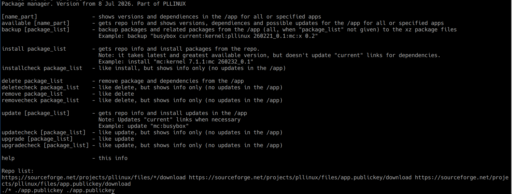
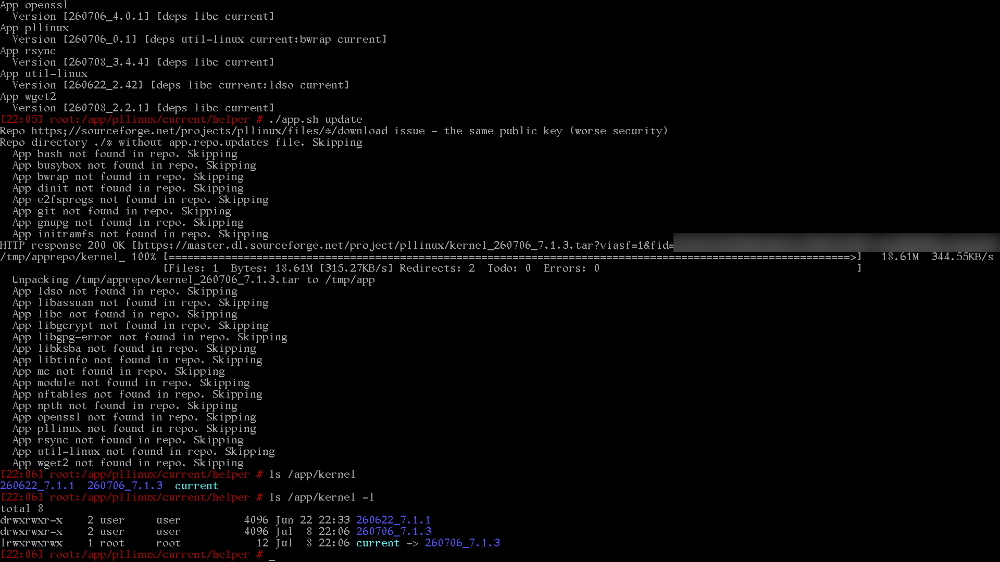

[Prev page](milestone3.md) [Next page](milestone5.md)

# Milestone 4
# Packaging versioning discussion

I will try to make brainstrom about versioning here, if you want summary, just go to another section.

Initial proposed naming in the PLLINUX was "date_version"

Examples:

    260510_5.0
    260512_5.0
    260511_6.0
    260514_5.0

As you can, it can resolve problem, when concrete version is repackaged with some fixes (for example security).

"But how to handle situation, when package has got git repo inside and we don't see version in folder name?"

This is unresolved and could be mitigated with version file inside app folder.

"And how to handle situation, when we want to change only app from the concrete generation? (in the example above: how to force system to update apps from the 1.x line and not touch 2.x line?)"

One possible solution:

We need extra information, which shows generation, for example:

    260510_1_5.0
    260512_1_5.0
    260511_2_6.0
    260514_1_5.0
    260515_1_5.1
or

    0000001_260510_5.0
    0000001_260510_5.1
    0000001_260610_5.2
    0000002_260410_6.0

"But what about situation, when somebody want to package version 4.0 or 3.0?

We don't have lower number than 0000001 (this cannot be easy resolved) and we have to return to original naming:

    260510_5.0
    260512_5.0
    260511_6.0
    260514_5.0

We just need tricky way to say:

1. upgrade app from all software lines (in the example 5.x and 6.x)
2. upgrade app to the latest possible version (for example 7.x or higher)
3. app needs to link to the latest possible (greatest) version or very concrete version or all versions from the concrete line

Let's concentrate on last point (number 3):

PLLINUX is already prepared for latest possible version (we say: link to "current") and with very concrete it's enough to give string "260510_5.0".

We could add third option with + on the end (for example "260510_5.0+") and implement few simple rules:

1. app package is later, when has got at least the same date (first six digits) AND
2. when we don't + on the end, we just take all packages with this string OR when we have + on the end:
   1. packet is higher, when some character in some place is higher than our character OR
   2. packet has got the character in all places AND packet has got longer version string

Looks complicated, but let's compare:

"260510_5.88+"

and

    "260510_5.9" - date is the same, but 9 in the end is higher than 0 (5.9 is later)
    "260510_5.8a" - date is the same and both 5.8 are the same, but a is bigger than 8 (5.8a is later)
    "260510_5.89" - 9 is higher than 8 (5.89 is later)
    "260510_5.101" - string is longer (5.101 is later than 5.88)

This looks promising, but still overcomplicated. Let's think logically - when you package 5.88, do you know, what will come later?

No and because of this "+" option is blind way... but replace "+" with "-" and provide easy way to show "we need higher version lower than specified".

"260510_5.9-"

In this concrete case it should be bigger than

    "260510_5.8a"
    "260510_5.7"
    "260510_5.0"

and system should take highest version from these "260510_5.8a" (or  "260510_5.8b",   "260510_5.8c", when they will be packaged)

# Packaging versioning conclusion

We implement few ways of giving app version in dependencies:

  * "current" - this is link to the latest and greatest version (or other setup by admin)
  * "date_version" - precise mentioning concrete version packaged on concrete day
  * "version-" - latest package with version lower than specified
  * "version" - latest package with this concrete version

Comparing versions was implemented this way:

 * "current" - we just follow link in the filesystem
 * "date_version" - we just take app from concrete folder
 * "version-" - we split version into segments (specified by dot) and compare all segments:
    * when both segments are numbers, we use number comparison (for example: 101 > 99, 1.101 > 1.99)
    * when any of segment contains character, we use string comparision (for example: b > a, 1a > 1, 1.2.1a > 1.2.1, 1.2.1beta > 1.2.1alpha)
    * when version doesn't have some segment, it's considered to be lower (for example: 1.0.a > 1.0, 1.1.1 > 1.1)

This should cover all typical cases.

# Package manager

There was implemented simple package manager with few important elements:

 1. list of repositories (link to the filesystem or https url)
 2. backup option (making backup of installed apps into package files)
 3. listing apps and updates
 4. installing/updating packages (with extra sandboxing)
 5. removing packages

This was written with shell script.

"But shell scripts are slow and ugly"

In this moment it's important to prepare AND optimalize all algorithms + it's good to have easy to maintain and audit code
(ok, sh or bash scripts are problematic in terms of maintaining, but good enough in this stage).

Let's look what we have (screen done from host system):

# Package format and authenticity checking

In first package manager versions we used high compression archive (currently tar.xz), currently there is used tar.xz put into tar file with extra OpenSSL signature together (I was considering GnuPGP as well, but in the end I'm more from the OpenSSL world and it can make all actions with less steps).

Inside tar.xz file there can be provided scripts directory with installation script - it's run in the bwrap sandbox with module dependencies and can create extra content in the dynamic directory.

Each repo needs two copies of public key used for signing packages - they must be stored in totally independent locations and the same
(when not, this can mean, that one of them was compromised and we maybe cannot trust packages anymore). In the future we will maybe additionally compare it to local copies too.

Anyway, first successfull upgrade from remote repo in real PLLINUX was done 9 Jul 2026:

[Prev page](milestone3.md) [Next page](milestone5.md)