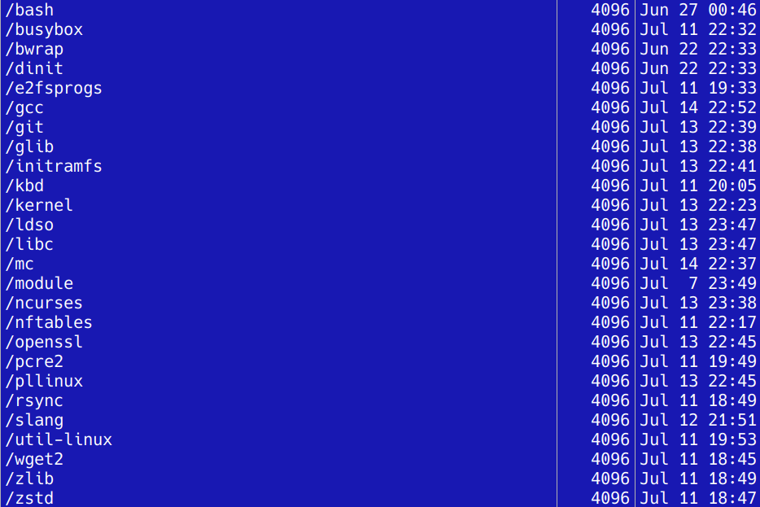
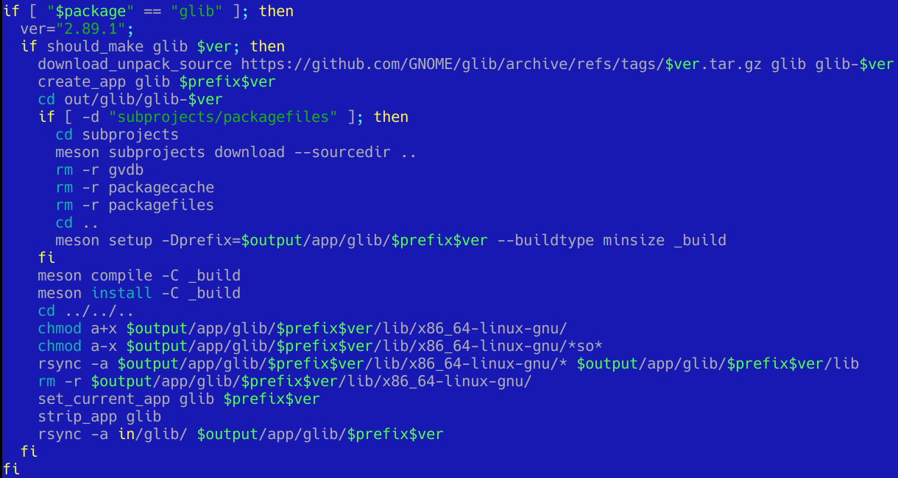
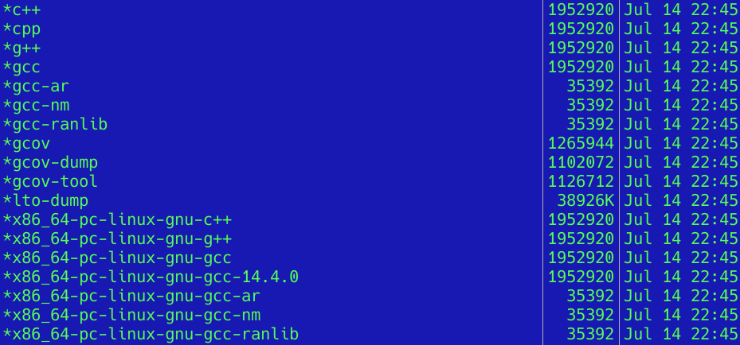
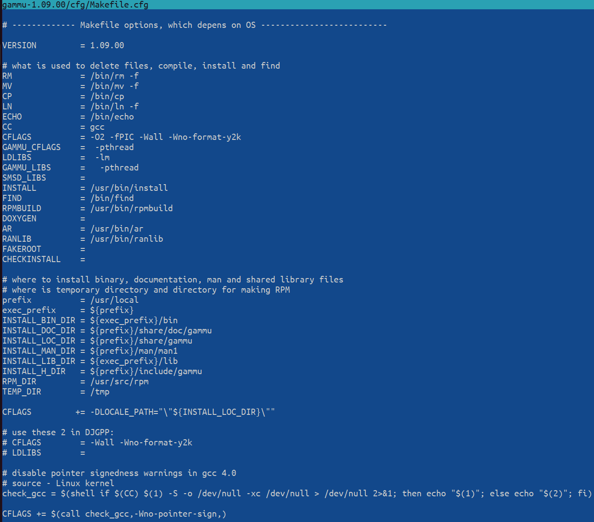

# Milestone 5
# New packages and options

Real OS needs software and a lot of things (from small things for example displaying git branch in console prompt and sandboxing package manager these way, that it cannot access user files, updating services with app manager, compiling in RAM disk, etc.).

Every day brings something new, for example in 14 Jul there are available these packages (I don't put mygpg in this list because I'm not using it in this moment):

In theory many of these apps are using autoconf/configure/meson or similar solution, but... in the end in every package you have thousands of lines of code just for configuration.

Example of problem:

I have found command for extra download subpackages after some research. This is for glib, which is not intentional (somebody could potentially say, that I don't like GTK and Gnome, but it's not relevant here). And now the questions:

  1. why such things are not very good documented?
  2. why all these build scripts from Debian or others have a lot of stuff?
  3. why we have so many bugs?

Another example (from gcc):

Why standard script cannot detect duplicated and just symlink them?

It reminds my hard work on [Gammu project (till ca. 2004 or so)](https://mwiacek.com/zips/gsm/gammu/stable/1_0x/), where I just created one screen scripts, for example:

It was so easier to understand than thousands of lines from automake, etc.

Anyway, I'm not complaining. For now I'm working mainly on machine with 16GB RAM/7840HS and this is still mostly enough.
There are new elements added (this stabilization phase will continue probably over few days or weeks)
and there is bigger and bigger need of having correct dynamic loader.
