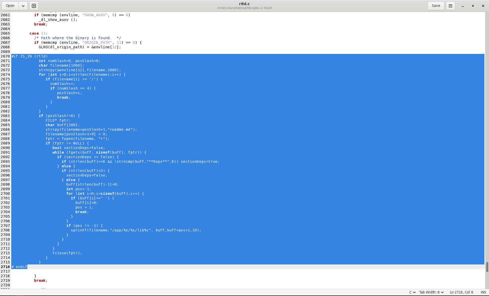
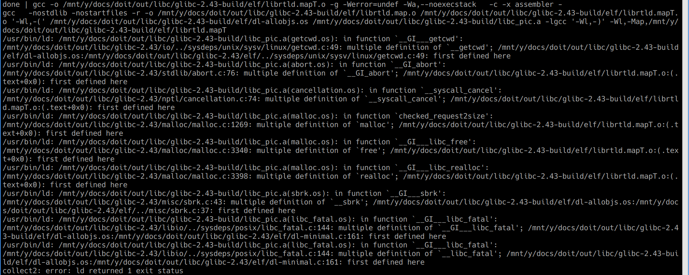
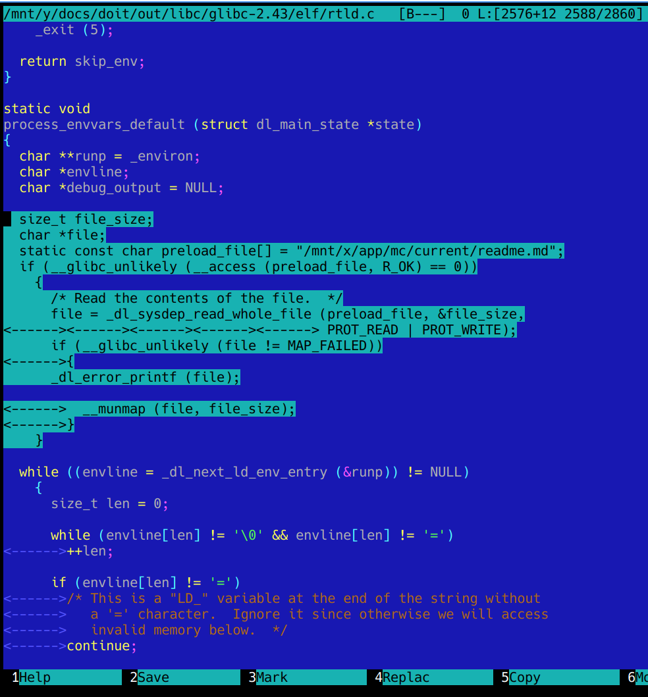
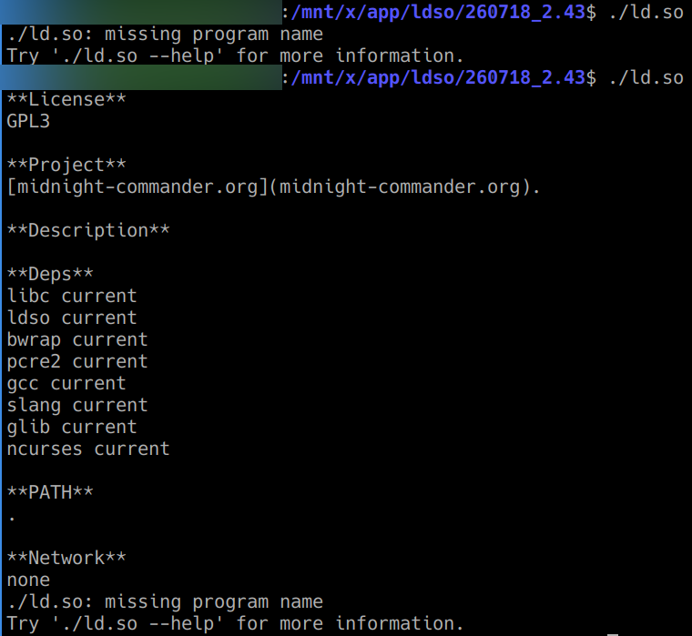

# Milestone 6
# Hacking ld-linux-x86-64.so.2

The main idea is, that PLLINUX should allow for starting binaries from other Linux systems without any / big changes. We don't think, that
NixOS approach (using elf-patcher) can be accepted. The correct approach is updating GNU dynamic loader (ld-linux-x86-64.so.2) and we have to break
rule saying, that we don't want to patch existing things (too much).

OK, how to do in very easy way? (we don't want to repeat projects having in goal writing loader from scratch like some projects in GitHub)

There are few ways:

1. having separate ld.so.cache in different places (loader should search and use correct one), which is not good because of maintaining and updating them
(and of course saving extra bytes on disk)
2. using LD_LIBRARY_PATH (loader should check binary location, read PLLINUX readme.md and create list provided further)

Option 2 seems to be easier and more ellegant. During some research there were found some places to patch:

1. elf/rtld.c (process_envvars_default)
2. elf/dl-load.c (dl_map_new_object)

With place 1 code was quite fast written (it's very ugly and just for starting some things)

but it end with compilation errors (rootcause is quite clear, but shows, that this path will need more code updates and because of it it's not very good)

Let's go to place 2... and we have the same linking problems. It looks, that in this place we cannot use stdio.h functions. Let's check it.

Bingo!

We have first from many very steps in good direction. Now we need to place it in correct function + get binary path + process. Simple, isn't it?

Well, there are at least two entry points, where we need to find our ELF executable name and path + we need to find and process our readme.md. Some puzzle elements (patch from glibc 2.43): [some patch elements](doit/in/libc/243_patch1.txt)

Real work starts now.