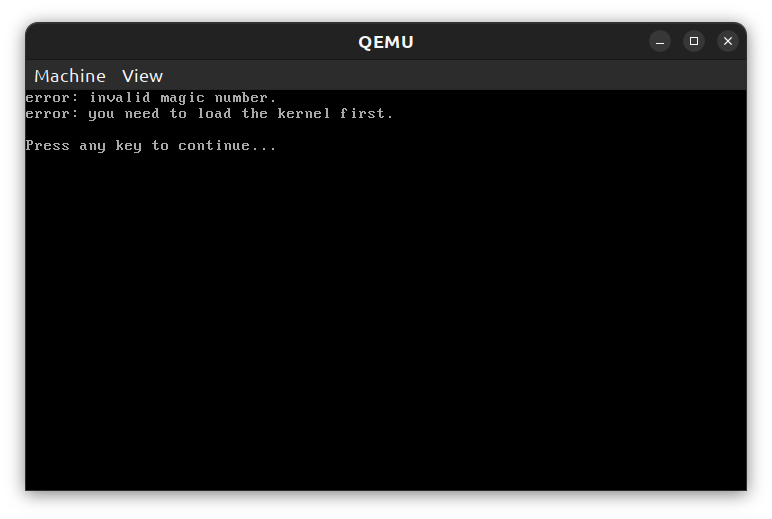
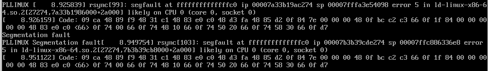
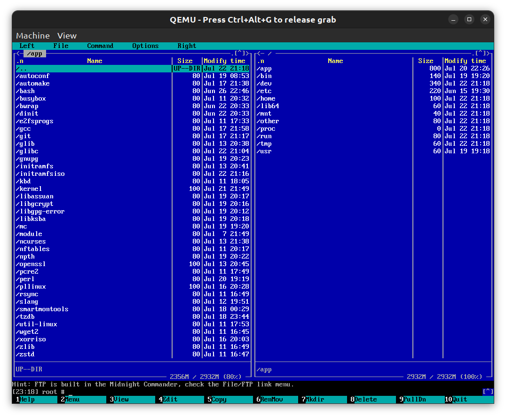

# Milestone 7
# Creating booting ISO image

First few links:

1. [Creating ISO Files in Linux: A Comprehensive Guide](https://linuxvox.com/blog/linux-create-iso/)
2. [How to Build a Custom Linux Live CD From Scratch: Optimizing for Fast Boot & Firmware Update Workflows](https://linuxvox.com/blog/building-a-custom-linux-live-cd/)
3. [GNU xorriso ISO 9660 Rock Ridge Filesystem Manipulator for GNU/Linux, FreeBSD, Solaris, NetBSD](https://www.gnu.org/software/xorriso/)
4. [How to create a custom Ubuntu live from scratch](https://github.com/mvallim/live-custom-ubuntu-from-scratch)
5. [Compiling the Linux kernel and creating a bootable ISO from it](https://medium.com/@ThyCrow/compiling-the-linux-kernel-and-creating-a-bootable-iso-from-it-6afb8d23ba22)
6. [grub-boot-loader-iso-file-create](https://github.com/Ankitkushwaha90/grub-boot-loader-iso-file-create)
7. [EFI Boot ISO Example](https://github.com/syzdek/efibootiso)
8. [How to create a 3-in-1 bootable USB drive on Linux](https://github.com/ndeineko/grub2-bios-uefi-usb)
9. [Multiboot USB drive](https://wiki.archlinux.org/title/Multiboot_USB_drive)

In many these descriptions creating boot drive working with UEFI is done with Grub. We try similiar approach especially that currently development is done in Debian "Trixy". There are two options:

1. creating booting ISO file (which could be written to USB as well)
2. creating image for USB with one or two partitions (FAT32+EXT4 or FAT32 with ISO file inside) - see for example

Option 1 seems to be easier:

1. download xorriso (**sudo apt-get install xorriso**) and eventually some Grub packages (**sudo apt-get install grub-pc-bin**)
2. prepare initramfs with [other init file (it's opening shell for check)](doit/in/initramfsiso/init)
3. create iso directory
4. put [grub.cfg](doit/in/boot/grub.cfg) inside iso\boot\grub
5. put kernel and initramfs packages into iso\app
6. make **grub-mkrescue -o iso.iso iso/ --disable-shim-lock**

Try to boot... for example with Qemu.

**qemu-system-x86_64 -cdrom iso.iso -m 4098**

Doesn't work after selecting menu option in Grub.

Try to replace initramfs with other (old) format and you will see funny info "qemu: linux kernel too old to load a ram disk" (Open Source like closed source
software is full of stupidy or funny things).

Replace kernel with some other (from Debian for example). And it works - we need only to resolve access to the /app and some other things
(why does it require 386 Grub version?), but... it looks, that standard PLLINUX kernel needs some updates OR
grub-mkrescue is blind way.

So, what went wrong?

First, kernel required things like SCSI CDROM support (our ISO is available under /dev/sr0 device with it). Second, qemu required extra option for UEFI boot:

**qemu-system-x86_64 -cdrom iso.iso -m 4098 -bios /usr/share/OVMF/OVMF_CODE.fd**

aaaannndddd third: in VirtualBox it was required to boot emulated UEFI menu and select CDROM from there. When we know it:

1. we could use /app from working PLLINUX
2. we could modify init script to make things similar like in doit.sh (creating all etc, sys, proc, etc. and for example getting files from /dev/sr0)
AND switching root there.

Easy, isn't it? Let's create script for it making it from the host first. First tries look promising, but... then it happens:

Super hiper dynamic loader is not working. But why? I didn't fully answer on that, but after adding all standard system folders (proc, sys, etc.) problem was gone. And finally with big pleasure I could announce, that first working ISO was created and started 22 Jul 2026

How it can be created ? Just setup isofile parameter and use doit.sh script with iso package.

What's the boot procedure?

1. there is started Grub (UEFI version)
2. after selecting boot menu entry Grub is running kernel with initramfs from initramfsiso package
3. init script from the initramfsiso is copying all apps from the ISO (it needs few sec and maybe won't be done in the future) and creating all elements in the filesystem in the RAM
4. init script is giving control to the created filesystem
5. changes done in this filesystem will be of course lost after restart