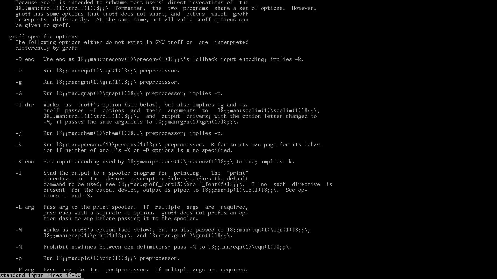
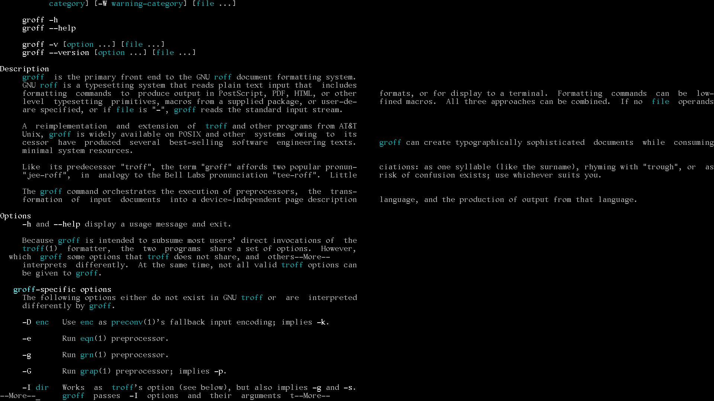

[Prev page](milestone7.md) [Next page]

# Milestone 8
# SSD writes

Over years disks were magnetic and it was possible to write data again and again without any limits.

This changed with flash memories. They have limited number of write cycles and there are few problems visible:

1. estimation of number of bytes to write in the form of TBW parameter is normally not given for OEM disks or some classes of devices 
(pendrives, chips in phones, tablets, memory cards, etc.) - you don't know, when they can fail
2. diagnostic is not provided for some classes of devices (memory cards, etc.) - again: you don't know, if they're failing
3. modern devices many times cost more, but have lower limits than older one (for example old 1TB SSD could have TBW 2400, new one 200) - nice progress, isn't it?
(and no: it's more greed of some companies instead of real crysis)
4. companies creating software for years didn't take care of number of disk writes - there were and are done thousands of
operations in the background although you don't make any action
(it includes collecting unnecessary logs, saving telemetry/spying data, making temporary operations in real disk, etc.
and very good example is Google removing Jumbo builds in Android Chrome ending with increasing compilation time from 1 to 4h
or Android/MacOS saving a lot of garbage in the pendrive)
5. replacing memory chips can need electronic service (it happens for example with Apple Macbooks)

PLLINUX during development and usage is trying to fight with problem of high usage of disk, for example:

  1. such directories like /mnt or /tmp are always maintaned in RAM
  2. compiling smaller software with [doit.sh](doit/doit.sh) script can be done and is done in RAM
  3. downloading files with [doit.sh](doit/doit.sh) is done in /tmp (RAM) and they're copied to download AFTER full download
  4. [app package manager](doit/in/pllinux/helper/app.sh) is downloading and unpacking to the /tmp (RAM)
  5. packages are or will be cleaned from useless content (currently it includes for example eliminating duplicats and stripping binaries,
in plan I have adding option for installing selected locales)

  7. system boot log is not saved - in the future it will be probably optional or done during system startup fail

# Localization

Many applications in PLLINUX are using Glibc. It has got command **locale -a** for showing all available locales, to generate new one you need to make something like:

**localedef -i pl_PL -c -f UTF-8 pl_PL.UTF-8**

This is creating file **locale-archive** in the **/app/glibc/.../lib/locale** (making this is ideal case for script running during installing glibc package). Later it's enough to make something like

**export LANG=pl_PL.utf8**

and applications will start displaying in your favourite language (if localization was prepared and it's setup in correct folder).

But what about displaying and typing national characters? boot.sh from PLLinux has got initially lines:

    # console font
    /app/kbd/current/bin/setfont -C /dev/tty1 sun12x22.psfu.gz 2> /dev/null
    /app/kbd/current/bin/setfont -C /dev/tty2 sun12x22.psfu.gz 2> /dev/null
    /app/kbd/current/bin/setfont -C /dev/tty3 sun12x22.psfu.gz 2> /dev/null
    /app/kbd/current/bin/setfont -C /dev/tty4 sun12x22.psfu.gz 2> /dev/null
    # keyboard
    /app/kbd/current/bin/loadkeys /app/kbd/current/share/keymaps/i386/qwerty/pl1.map.gz

and it didn't work.

# Logging

dmesg - kernel messages

# Mounting CD-ROM and memory cards

In the Linux CD-ROM is handled with SCSI

echo 0 0 0 > /sys/class/scsi_host/host*/scan

echo - - - > /sys/class/scsi_host/host*/scan

# Manual pages

Realized with groff and [some script](doit/in/groff/man). Man-db is not required. Combination of groff and other displaying tools can give different results:

(with less)

(with more)

For now first step is done, for the future there must be resolved all displaying issues, support for packed files and links.

# Sound

# CPU microcode and kernel packages
