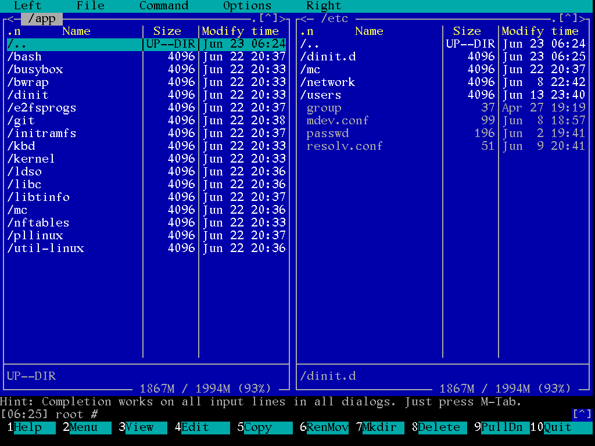
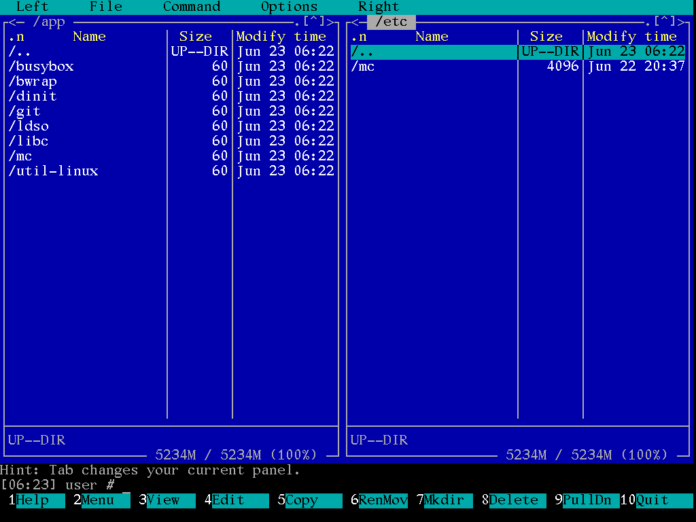
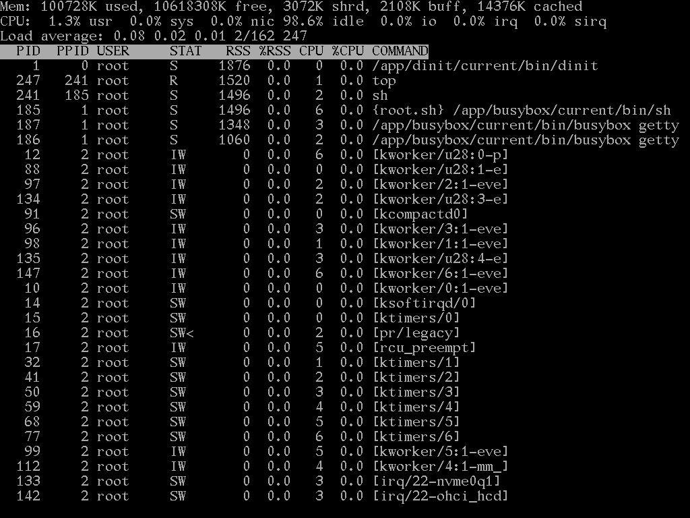

*"...I'm doing a (free) operating system (just a hobby, won't be big and
professional like GNU) for Intel and AMD CPU clones. This has been
brewing since April..."*

This is project with operating system built around Linux kernel and Bubblewrap (bwrap) with extra separating apps in the main filesystem (something like in NixOS, but done differently).

**Important points**

  1. providing full possible freedom with free apps and free licenses
  2. splitting apps and users in different way than in typical Linux distributions, which gives much more security and flexibility (you can provide and show other apps to other users, package scripts can run in the sanbdbox, upgrades and rollbacks are much easier, etc.)
  3. reproducible and reliable results (dependiences among apps must be always defined and thing running in one installation will work on the other, all systems actions will be done in user specified time, etc.)
  4. simplicity for devs and users (easy to audit scripts, easy system structure, etc.)
  5. consistency
  6. decreasing resources usage (using tmpfs where possible, etc.)
  7. when possible, providing real support for people with disabilities

When you think, this is just utopia, look on screens below - is it possible with your Linux?

**Plans**

Currently in early alpha. Some things are done and many still todo:

 0. [Milestone 0 - more deep initial info](milestone0.md)
 1. [Milestone 1 - development environment, booting process, filesystem structure, core components, rebooting](milestone1.md)
 2. [Milestone 2 - mounting USB devices](milestone2.md)
 3. [Milestone 3 - app folder structure, network, dynamic linking and interpreters (again), packages, system in this moment](milestone3.md)
 4. [Milestone 4 - real packet manager](milestone4.md)
 5. [Milestone 5 - SSD writes, logging, manual pages]
 6. [Milestone 6 - sound, CPU microcode and kernel packages]
 7. Milestone 7 - dbus? AppArmor? SeLinux?
 8. Milestone 8 - easy configuration
 9. Milestone 9 - more packages, software compiling, etc.
 10. Milestone 10 - installation
 11. Milestone 11 - graphic UI
 12. Milestone 12 - big party?

This can change without earlier notice.

One note: main author of PLLINUX was preparing Open Source software before 2000 year already and some gaps in current builds are connected mainly with time available for the project.

**Important dates**

  1. 16 April 2026 - start
  2. 22 June 2026 - making GitHub repo public (with tested script for distribution building)

**Building and starting**

  1. install Debian "Trixie" (build script is created inside it; probably any last Debian/Ubuntu distribution should work without changes)
  2. create and mount new EXT4 partition
  3. point this partition in the [build script doit.sh](doit/doit.sh)
  4. run [build script doit.sh](doit/doit.sh) (it can ask sometimes for sudo for dependiences)
  5. add PLLINUX to the GRUB (create [file /etc/grub.d/40_custom](2026/40_custom) with correct UUID for new filesystem get with **sudo blkid**)
  6. restart and have fun.

In this moment (16 Jun 2026) PLLINUX filesystem needs 127MB and place for compiling 27GB. Secure Boot needs to be disabled now, UEFI required.

In the future there will be of course created ISO and installer.

**How can you help?**

  1. proposing new ideas - it's never too late for them
  2. showing this project to other people - good party must be big & nothing helps more than testers, users and developers
  3. submitting bugs - project is very early stage, but don't be shy, when have something to say
  4. updating existing dynamic loader or making other development - always welcome (mainly C or Bash shell scripting now)
  5. packaging software - always welcome (mainly Bash shell scripting now)

**Contact**

Use for example GitHub or marcin ( at ) mwiacek ( dot ) com. I'm not answering very fast, but in the end it always happens.
