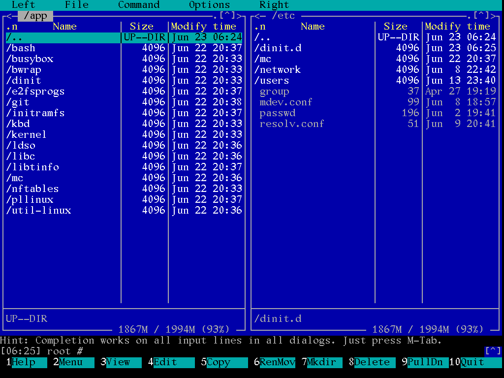
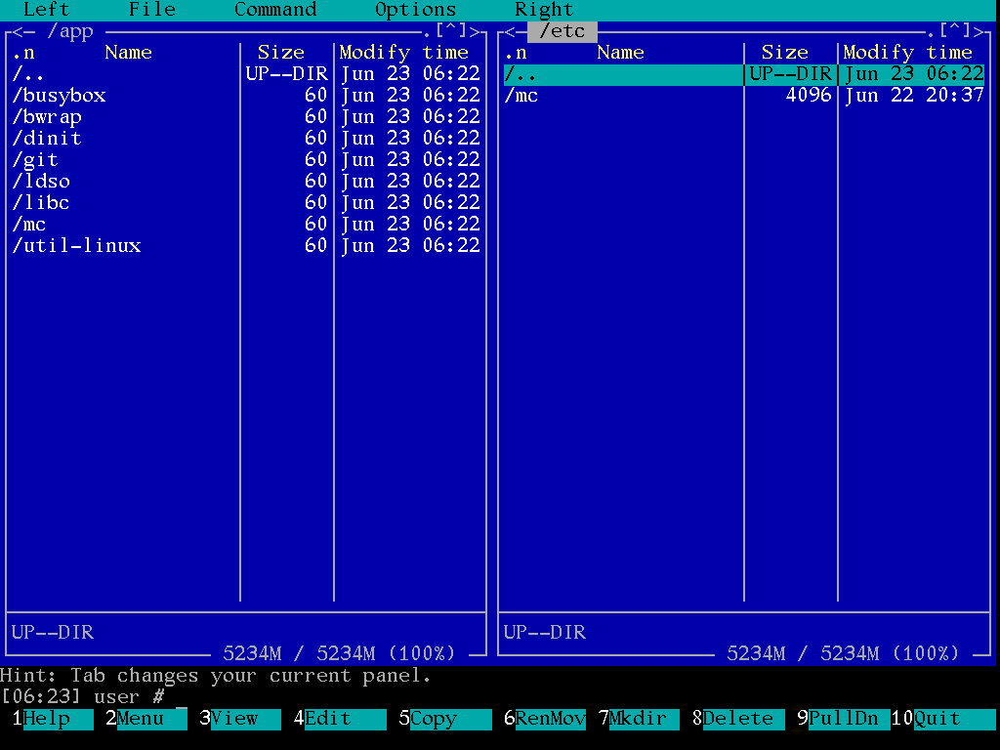
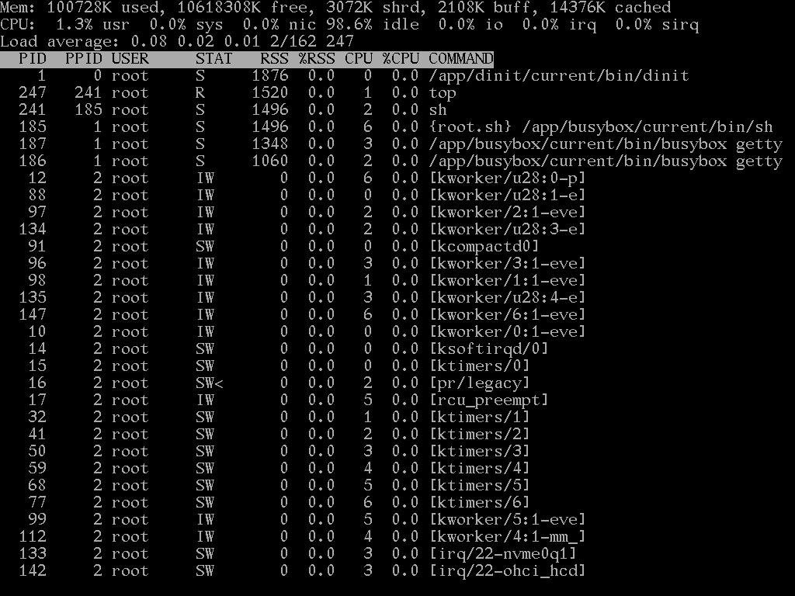
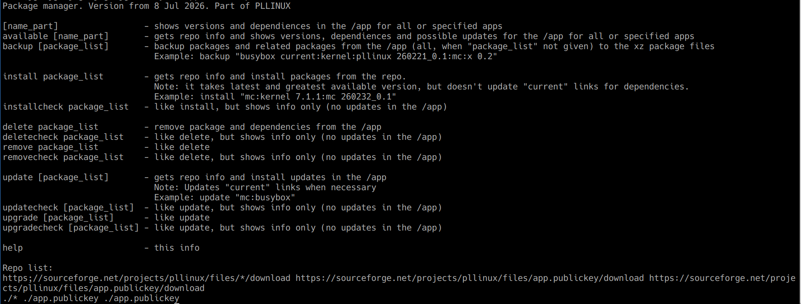

[Next page](file_yz_milestone0.md)

*"...I'm doing a (free) operating system (just a hobby, won't be big and
professional like GNU) for Intel and AMD CPU clones. This has been
brewing since April..."*

This is project with operating system built around Linux kernel and Bubblewrap (bwrap) with extra separating apps in the main filesystem (something like in NixOS, but done differently).

**Important points**

  1. providing full possible experience and freedom with free apps and free licenses - giving them higher priority, when they're so good like other solutions, etc.
  2. simplicity for devs and users - easy to audit scripts & system structure, no unnecessary updates for existing binaries and apps (like in NixOS), etc.
  3. splitting apps and users in different way than in typical Linux distributions (gives much more security and flexibility) - you can provide and show other apps to other users, package scripts run in the sanbdbox without access to user files,
upgrades and rollbacks are much easier, etc.
  4. reproducible and reliable results and consistency - apps dependencies must be always clearly defined and things running in one installation will work on the other, all systems actions will be done in clearly defined user specified time, etc.
  5. decreasing resources usage to minimum - using tmpfs where possible, eliminating bloat processes, etc.
  6. providing real support for people with disabilities
  7. using modern version of tools (for example wget2 instead of wget) and leaving various decisions to the user without forcing them to anything - if utils-rs will be packaged, there will be always proposed original GNU utils as well, etc.

When this is not enough, I invite to reading short text [Why PLLinux?](https://mwiacek.com/www/?q=node/642).

When you still think, this is just utopia, look on screens below - is it possible with your Linux?

(last screen was done from the host)

**Plans**

Currently in early alpha. Some things are done and many still todo:

 0. [Milestone 0 - more deep initial info](file_yz_milestone0.md)
 1. [Milestone 1 - development environment, booting process, filesystem structure, core components, rebooting](file_yy_milestone1.md)
 2. [Milestone 2 - mounting USB devices](file_yx_milestone2.md)
 3. [Milestone 3 - app folder structure, network, dynamic linking and interpreters (again), packages, system in this moment](file_yw_milestone3.md)
 4. [Milestone 4 - real packet manager](file_yv_milestone4.md)
 5. [Milestone 5 - new packages and options](file_yu_milestone5.md)
 6. [Milestone 6 - hacking ld-linux-x86-64.ld.so2 / dynamic loader searching for apps inside /app](file_yt_milestone6.md)
 7. [Milestone 7 - Creating booting ISO image](file_ys_milestone7.md)
 8. [Milestone 8 - SSD writes, localization, manual pages, configurator](file_yr_milestone8.md)
 9. [Milestone 9 - correct man, configurator with dialog, partitioning, device manager](file_yq_milestone9.md)
 10. [Milestone 10 - scheduler, logging, sound, CPU microcode and kernel packages]
 11. Milestone 11 - dbus? AppArmor? SeLinux?
 12. Milestone 12 - more packages, software compiling and matrioszka (compiling PLLinux from PLLinux), etc.
 14. Milestone 14 - installation with Secure Boot and shim
 15. Milestone 15 - packages with optional config (for example installing some localization only or removing a files) and impossible things (deleting to trash)
 16. Milestone 16 - graphic UI
 17. Milestone 17 - big party?

This can change without earlier notice.

One note: main author of PLLINUX was preparing Open Source software before 2000 year already and some gaps in current builds are connected mainly with time available for the project.

**Important dates**

  1. 16 April 2026 - start
  2. 22 June 2026 - making GitHub repo public (with tested script for distribution building)
  3. 9 July 2026 - package manager and [first package online in the freshmeat.net / sourceforge.net](https://sourceforge.net/projects/pllinux/files/)
  4. 18 July 2026 - first version of own dynamic loader IS WORKING!
  5. 22 July 2026 - creating first working ISO
  6. 13 Aug 2026 - system first time cloned itself ("installed") from PLLinux administration script. This is huge step into full working installation process - we have disk partitioning, selecting partition for installation and installing, we still need setting up UEFI partition/menu and encryption for main filesystem.

**Building and starting**

  1. install Debian "Trixie" (build script is created inside it; probably any last Debian/Ubuntu distribution should work without changes)
  2. create and mount new EXT4 partition
  3. point this partition in the [build script doit.sh](doit/doit.sh)
  4. run [build script doit.sh](doit/doit.sh) (it can ask sometimes for sudo for dependiences)
  5. add PLLINUX to the GRUB (create [file /etc/grub.d/40_custom](2026/40_custom) with correct UUID for new filesystem get with **sudo blkid**)
  6. (if necessary) increase resolution in /etc/default/grub (GRUB_GFXMODE=1920x1080 or something similar)
  7. execute **update-grub** command
  8. restart and have fun (users: root/root, user/user, user2/user2)

In this moment (16 Jun 2026) PLLINUX filesystem needs 127MB and place for compiling 27GB. Secure Boot needs to be disabled now, UEFI required.

In the future there will be of course created ISO and installer.

**How can you help?**

  1. proposing new ideas - it's never too late for them
  2. showing this project to other people - good party must be big & nothing helps more than testers, users and developers
  3. submitting bugs - project is very early stage, but don't be shy, when have something to say
  4. further updates for existing dynamic loader or making other development - always welcome (mainly C or Bash shell scripting now)
  5. packaging software - always welcome (mainly Bash shell scripting now)

**Contact**

Use for example GitHub or marcin ( at ) mwiacek ( dot ) com. I'm not answering very fast, but in the end it always happens.

[Next page](file_yz_milestone0.md)
